*ztv* - astronomical image viewer
===============================

*ztv* is an astronomical image viewer designed to be used from a python command line for display and analysis. 

*ztv* is useful as-is for display and simple analysis of images already loaded in to [numpy arrays](http://www.numpy.org), as well as [FITS files](http://fits.gsfc.nasa.gov/fits_primer.html). It can display the most recently acquired image by watching a directory for new FITS files to appear or watching a single FITS file for when it changes. It can also receive new images via an [ActiveMQ message stream](http://activemq.apache.org). 

*ztv* is intended for real-time display and analysis. *ztv* is not intended to produce publication quality figures. 

*ztv* comes with a number of built-in control panels, for:
- selecting input source (FITS file, auto-reload from FITS file, etc)
- selecting a frame to subtract (e.g. sky or dark) and a flat field frame to divide by
- setting colormap, stretch, and lower/upper limits
- doing basic slice plots, statistics, and aperture photometry.
Additional panels can be written and added, for e.g. controlling a camera. (One example add-on panel is included that generates faked images in the FITS format.)

If proper FITS header keywords are available, *ztv* will display the ra/dec of the cursor point.

Examples of usage
=================

To launch:

    import ztv
    z = ztv.ZTV()

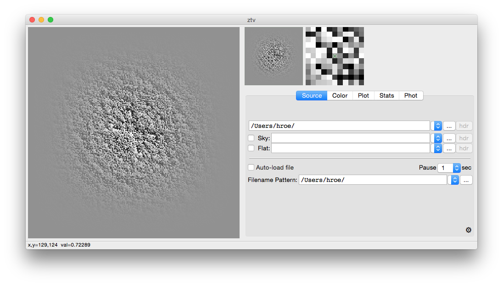

To load an image in a numpy array:

    import numpy as np
    im = np.random.normal(size=[10, 256, 256])  # create a 3-d image stack
    z.load(im)

You can now look at your data, manipulate display parameters, etc all using the gui elements. All of these elements are accessible through the tabbed control panels. You can also switch amongst the control panel tabs by `cmd-alt-#` where *#* is the number of the panel, starting from 1. Or, by `cmd-[` and `cmd-]` to move left/right amongst the tabs. You can even switch tabs from the command line api, e.g.:

    z.control_panel('Color')

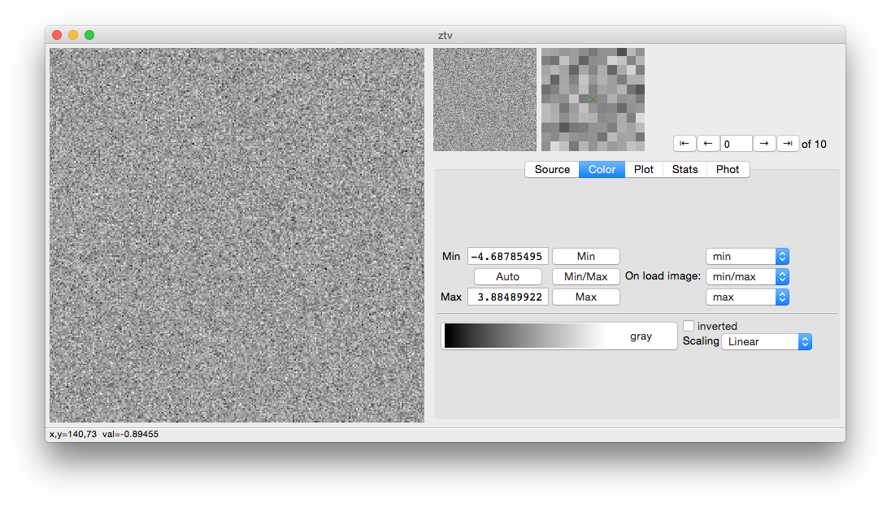

To change cursor mode, press `cmd-#` where *#* is the number shown in the pop-up menu that's available by right-clicking in the primary image area:

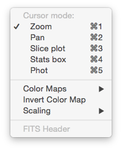

To manipulate display parameters:

    z.cmap('gist_heat')
    z.minmax(0., 4.)
    z.scaling('Sqrt')
    z.xy_center(100, 100)
    z.zoom(5.)

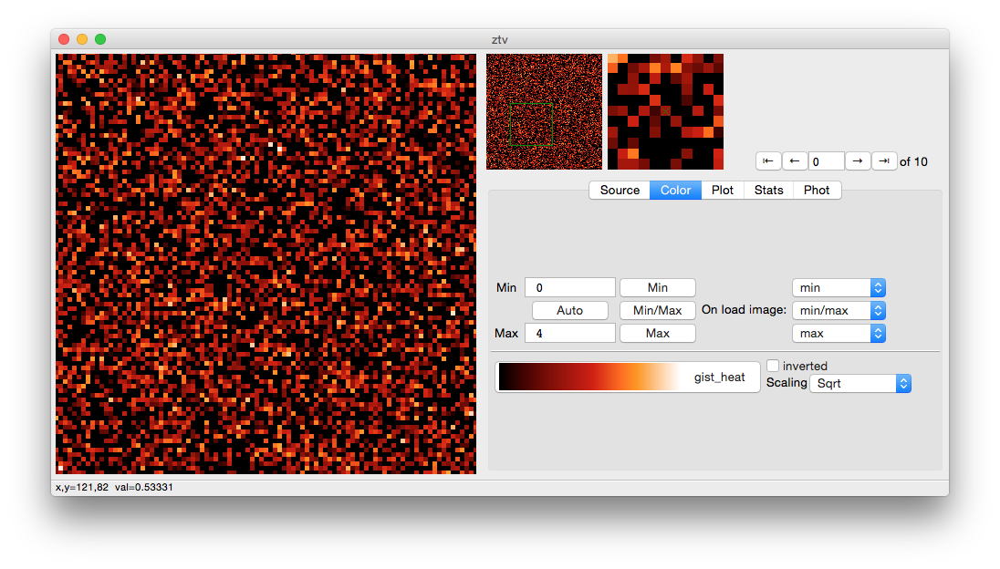

To set up a statistics box and see the GUI output (note that output is also returned to your command line as a dict):

    z.stats_box(xrange=[80, 100], yrange=[100,120], show_overplot=True)
    z.control_panel('Stats')

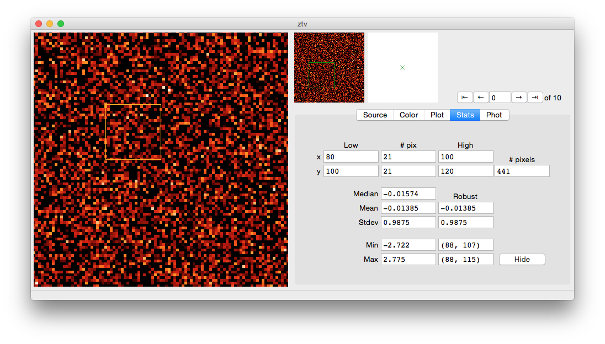

There's a lot more you can do from the command line if you play with *ztv*, especially in an exploration-friendly environment like [ipython](http://ipython.org/). And, anything you can do from the command line can be done from the GUI.

Download an iconic FITS image from the web and display it:

    from urllib import urlopen
    from zipfile import ZipFile
    from StringIO import StringIO
    remote_url = 'http://www.spacetelescope.org/static/projects/fits_liberator/datasets/eagle/656nmos.zip'
    local_filename = '/tmp/hst-eagle-nebula-656nmos.fits'
    zip = ZipFile(StringIO(urlopen(remote_url).read()))
    zip_filename = zip.filelist[0].filename
    open(local_filename, 'w').write(zip.open(zip_filename).read())
    z.load(local_filename)
    z.scaling('Log')
    z.minmax(0, 500)

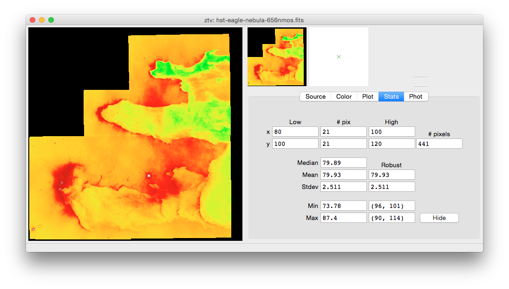

We can even do a little aperture photometry while we're here:

    z.cmap('gray')
    z.xy_center(624, 524)
    z.zoom(4)
    z.minmax(0, 1000)
    z.scaling('Asinh')
    z.control_panel('phot')
    z.aperture_phot(xclick=614, yclick=516, show_overplot=True)

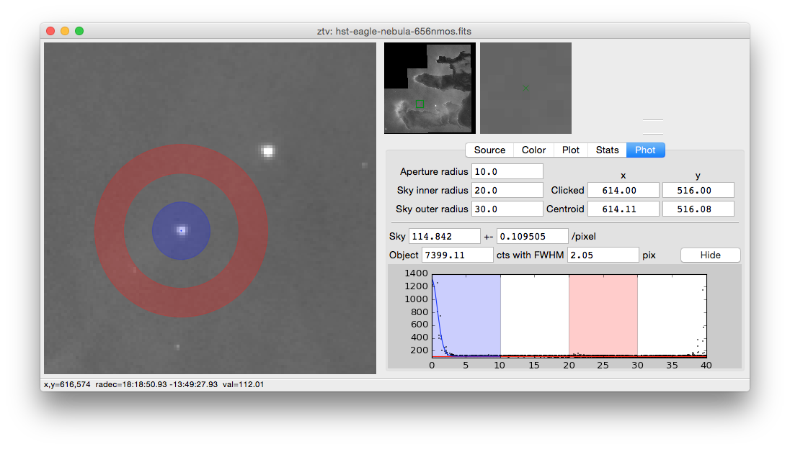

And, of course, you can adjust the window size to suit your needs, either smaller:

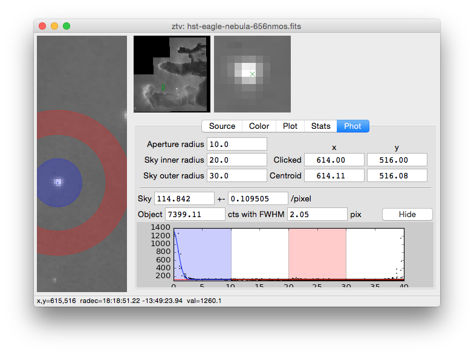 

or larger:

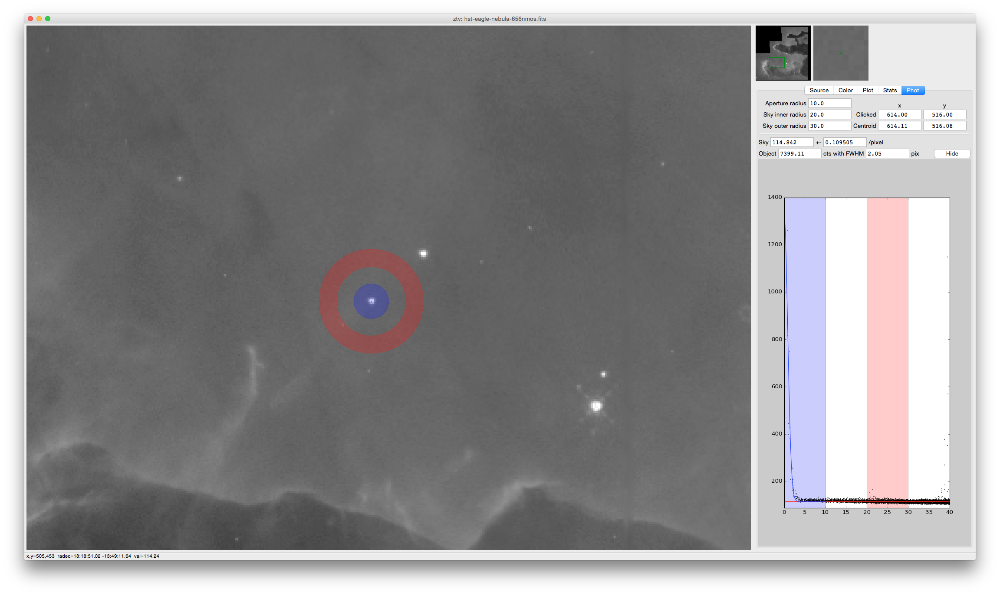

Example of an Add-on Control Panel 
----------------------------------

One of the motivating use cases for *ztv* was real-time quick-look of incoming images and the ability to extend the basic installation, including instrumentat control. An example of this is that *ztv* will be used to both control and inspect the images from a slit viewing camera on a spectrograph of mine. To demonstrate this extensibility, there's a simple example in `ztv_examples/fits_faker_panel/`:

    from ztv_examples.fits_faker_panel.launch_ztv import launch_ztv
    z = launch_ztv()
    z.start_fits_faker()

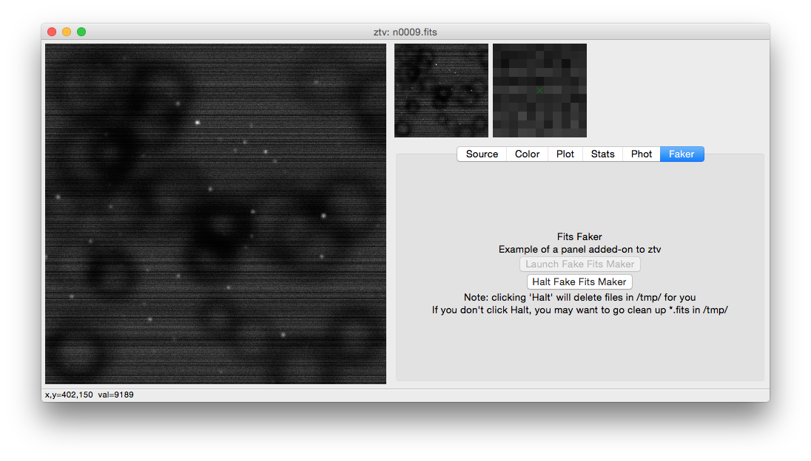

Our fake example data looks a lot better when we subtract the sky and divide the flat field (someone needs to blow the dust off that fake dewar window...):

    z.control_panel('Source')
    z.sky_frame(True)
    z.flat_frame(True)

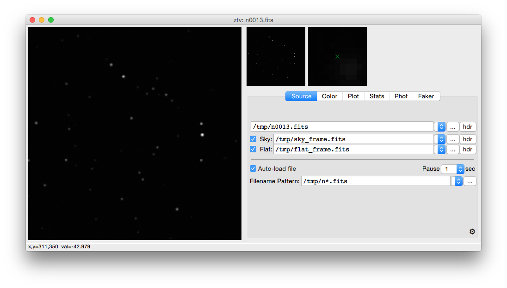

Installation and Dependencies
=============================

*ztv* uses several packages, including [wxPython](http://wxpython.org), [astropy](http://www.astropy.org). These should be automatically installed if you install *ztv* with:

    pip install ztv
    
You can also grab source code from [github](https://github.com/henryroe/ztv).

Note that *ztv* was developed and tested on OS X. 

**Linux/Ubuntu:** I tested briefly on Ubuntu 14.04. *ztv* basically works, although the pulldown colormap menus will not have bitmaps of the colormaps.  Also, (at least on my testing virtual machine) the performance of *ztv* was much laggier than on my main OS X laptop. For the colormaps you could try looking at [this link](http://askubuntu.com/questions/464146/how-to-enable-icons-in-menus-in-ubuntu-14-04), but it didn't work on my test system.

Background
==========

In graduate school in the late 1990's I learned [IDL](http://en.wikipedia.org/wiki/IDL_(programming_language)) and used [Aaron Barth's ATV](http://www.physics.uci.edu/~barth/atv/) extensively. I even contributed a little to a now-outdated version of [ATV](http://www.physics.uci.edu/~barth/atv/), adding 3-d image stack capability. [ATV](http://www.physics.uci.edu/~barth/atv/) was and is incredibly useful for quick-looks at image data, analysis, and all the things you want when working with typical astronomical image data.

After graduate school I began migrating toward python and away from IDL. I've written about this choice elsewhere, but some of the basic reasons were to avoid IDL licensing issues and being beholden to one company. (To be fair, how much I pay every year to keep my IDL license current has always been reasonable. It helps that my license has some obscure history to it that makes the maintenance fees moderate. But, at any time they could raise the prices on me massively. And, I wanted to use a language that could effectively be on every machine I touch, from my main laptop to an embedded server.)

In python there are already a multitude of possible image viewers. Many of which are great and can do much of what I needed. (See next section for some links.) But, inevitably as I've played with them I've found they each doesn't scratch my itch in some way. I wanted something that worked exactly the way I wanted, with the right (for me) mix of complexity and simplicity. I need day-to-day image quicklook from the python command-line, e.g. while I'm developing some new image processing algorithm or to check on last night's data. But, I also need to be able to easily adapt my viewer to other situations, including real-time use on a slit-viewing camera, quick-reduction of incoming data, etc.. So, I wrote *ztv*.

The name *ztv* is an obvious play off of [ATV](http://www.physics.uci.edu/~barth/atv/). And, "z" is my daughter's middle initial. 

Other Image Viewers You Should Check Out
========================================

- If you're using IDL, check out [ATV](http://www.physics.uci.edu/~barth/atv/) of course!
- [SAOImage DS9](http://ds9.si.edu/site/Home.html)
- [Aladin Desktop Sky Atlas](http://aladin.u-strasbg.fr) (not primarily an image viewer, but can open FITS files and overlay catalogs and other images nicely)
- [ginga](http://ejeschke.github.io/ginga/)
- [Toyz](http://fred3m.github.io/toyz/)

(If your favorite isn't on this list, please email hroe@hroe.me to get it added.)

Acknowledgements
================

Thank you to Aaron Barth for his original [ATV](http://www.physics.uci.edu/~barth/atv/). Thank you to all the numerous people who have put so much effort in to all the packages that make my work not only easier but possible. I especially thank the developers of [astropy](http://www.astropy.org) and its associated packages.  e.g. It's an amazing thing to do correct FITS coordinate conversions in one line of code.

Author
======
Henry Roe (hroe@hroe.me) 

License
=======
*ztv* is licensed under the MIT License, see ``LICENSE.txt``. Basically, feel free to use any or all of this code in any way. But, no warranties, guarantees, etc etc..